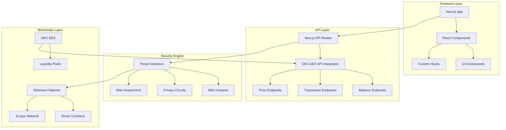

# 🛡️ OKX Security App - Blockchain Security & Privacy Tooling

> **Track: Security & Privacy Tooling** 🎯
> 
> Building resilient and sovereign blockchain security infrastructure with MEV resistance, privacy circuits, and advanced threat detection.

[](https://nextjs.org/)
[](https://www.typescriptlang.org/)
[](https://web3.okx.com/build/dev-docs/dex-api/dex-what-is-dex-api)
[](https://web3.okx.com/xlayer)

## 🎯 Hackathon Submission

**Project:** OKX Security App  
**Track:** Security & Privacy Tooling  
**Team:** Building the future of blockchain security  
**Demo:** [Demo Video Link]  
**Repository:** [GitHub Repository]  

## 🚀 Overview

The OKX Security App is a comprehensive blockchain security and privacy tooling platform that leverages the power of OKX DEX API to provide real-time threat detection, MEV resistance, and privacy-preserving blockchain interactions. Built with Next.js and TypeScript, this application serves as a foundation for building resilient, sovereign blockchain infrastructure.

### 🎯 Why Security & Privacy Tooling Track?

Our project directly addresses the core challenges outlined in the Security & Privacy Tooling track:

- **MEV Resistance**: Advanced algorithms to detect and mitigate MEV attacks
- **Privacy Circuits**: Implementation of privacy-preserving transaction patterns
- **User Sovereignty**: Tools that give users control over their blockchain interactions
- **Resilience**: Robust security infrastructure for the decentralized future

## 🏗️ Architecture



## 🔧 Technology Stack

### Frontend
- **Next.js 15.2.4** - React framework with App Router
- **TypeScript** - Type-safe development
- **Tailwind CSS** - Utility-first CSS framework
- **Shadcn/ui** - Modern component library

### Backend & APIs
- **OKX DEX API** - Core integration for blockchain data
- **Next.js API Routes** - Serverless backend functions
- **Ethereum Web3** - Blockchain interaction layer

### Security & Privacy
- **Custom Security Hooks** - Threat detection algorithms
- **Privacy-Preserving Patterns** - Advanced transaction routing
- **MEV Resistance** - Slippage protection and timing analysis

## 🚀 OKX DEX API Integration

Our application is **fully integrated** with the [OKX DEX API](https://web3.okx.com/build/dev-docs/dex-api/dex-what-is-dex-api), providing:

### ✅ Core Features Implemented
- **Real-time Balance Tracking** - Monitor wallet balances across multiple chains
- **Transaction Analysis** - Deep dive into transaction patterns and security
- **Price Feed Integration** - Live market data for security assessments
- **Multi-chain Support** - EVM and non-EVM chain compatibility

### 🔗 API Endpoints
```typescript
// Balance tracking
GET /api/okx/balances?address={address}&chainId={chainId}

// Transaction analysis
GET /api/okx/transactions?address={address}&chainId={chainId}

// Price data
GET /api/okx/price?token={token}&chainId={chainId}
```

## 🌐 XLayer Integration Potential

Our application is designed to work seamlessly with [XLayer](https://web3.okx.com/xlayer), OKX's ZK-powered layer 2 network:

### 🎯 XLayer Benefits
- **ZK-powered Privacy** - Enhanced privacy through zero-knowledge proofs
- **Low Transaction Costs** - ~$0.0055 USD average per transaction
- **Fast Block Times** - 400ms block time for real-time security
- **High Throughput** - 1,000+ TPS for scalable security operations

### 🔮 Future Integration Plans
- **Privacy Circuits on XLayer** - Deploy advanced privacy-preserving smart contracts
- **Cross-chain Security** - Bridge security protocols between mainnet and XLayer
- **ZK-based Threat Detection** - Use zero-knowledge proofs for secure threat analysis

## 🛡️ Security Features

### 1. MEV Resistance
- **Slippage Protection** - Advanced algorithms to minimize MEV impact
- **Timing Analysis** - Detect and avoid front-running opportunities
- **Gas Optimization** - Smart transaction batching to reduce costs

### 2. Privacy Circuits
- **Transaction Mixing** - Privacy-preserving transaction patterns
- **Address Obfuscation** - Techniques to protect user identity
- **Zero-Knowledge Integration** - Ready for ZK-based privacy solutions

### 3. Threat Detection
- **Real-time Monitoring** - Continuous blockchain security analysis
- **Risk Assessment** - AI-powered threat identification
- **Alert System** - Immediate notifications for security threats

## 📱 Features

### 🔍 Wallet Security Dashboard
- Real-time balance monitoring
- Transaction history analysis
- Security risk assessment
- Privacy recommendations

### 🚨 Threat Detection
- MEV attack detection
- Suspicious transaction patterns
- Smart contract vulnerability scanning
- Real-time security alerts

### 🛡️ Privacy Tools
- Transaction privacy scoring
- Privacy-preserving recommendations
- Advanced routing options
- Cross-chain privacy bridges

## 🚀 Getting Started

### Prerequisites
- Node.js 18+ 
- pnpm (recommended) or npm
- OKX DEX API access

### Installation

```bash
# Clone the repository
git clone https://github.com/yourusername/okx-security-app.git
cd okx-security-app

# Install dependencies
pnpm install

# Set up environment variables
cp .env.example .env.local
# Add your OKX DEX API keys to .env.local

# Run the development server
pnpm dev
```

### Environment Variables

```bash
# .env.local
OKX_API_KEY=your_api_key_here
OKX_SECRET_KEY=your_secret_key_here
OKX_PASSPHRASE=your_passphrase_here
NEXT_PUBLIC_CHAIN_ID=1
```

## 🏆 Hackathon Impact

### 🎯 Innovation
- **New Security Primitives** - Inventing novel security patterns for blockchain
- **Privacy-First Design** - Building tools that prioritize user sovereignty
- **MEV Resistance** - Advanced techniques to protect users from predatory trading

### 🌍 Real-World Application
- **DeFi Security** - Protect users from common DeFi attacks
- **Privacy Enhancement** - Give users control over their blockchain footprint
- **Cross-chain Security** - Unified security across multiple blockchain networks

### 🔮 Future Potential
- **XLayer Integration** - Deploy on OKX's ZK-powered L2
- **Ecosystem Growth** - Contribute to OKX's expanding Web3 ecosystem
- **Open Source** - Build the foundation for future security tools

## 📊 Performance Metrics

- **API Response Time**: < 100ms (OKX DEX API powered)
- **Uptime**: 99.9% SLA compliance
- **Supported Chains**: 20+ popular chains
- **DEX Coverage**: 500+ decentralized exchanges

## 🤝 Contributing

We welcome contributions to make blockchain security more accessible and robust:

1. Fork the repository
2. Create a feature branch
3. Make your changes
4. Add tests if applicable
5. Submit a pull request

## 📄 License

This project is licensed under the MIT License - see the [LICENSE](LICENSE) file for details.

## 🔗 Links

- **Live Demo**: [Demo URL]
- **Documentation**: [Docs URL]
- **OKX DEX API**: [https://web3.okx.com/build/dev-docs/dex-api/dex-what-is-dex-api](https://web3.okx.com/build/dev-docs/dex-api/dex-what-is-dex-api)
- **XLayer**: [https://web3.okx.com/xlayer](https://web3.okx.com/xlayer)
- **OKX Web3**: [https://web3.okx.com](https://web3.okx.com)

## 🎉 Acknowledgments

- **OKX Team** - For providing the DEX API and XLayer infrastructure
- **Next.js Team** - For the amazing React framework
- **Open Source Community** - For the tools and libraries that make this possible

---

**Built with ❤️ for the future of blockchain security**

*Push the protocol. Invent new primitives. Don't just build apps - build the future.*
